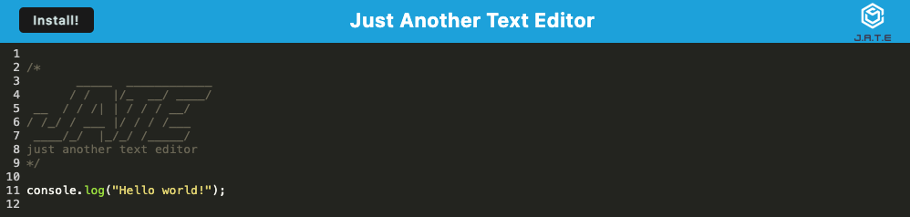

# Just Another Text Editor (J.A.T.E)


## Description

Just Another Text Editor (J.A.T.E) is a progressive web application (PWA) that allows developers to create notes or code snippets with or without an internet connection. This application leverages modern web technologies such as IndexedDB for data persistence, service workers for offline functionality, and Webpack for bundling assets. J.A.T.E is designed to be installed as a standalone application on your device and works seamlessly offline.

## Table of Contents

- [Installation](#installation)
- [Usage](#usage)
- [Features](#features)
- [License](#license)

## Installation

To run the application locally, follow these steps:

1. Clone the repository:
```
git clone https://github.com/yueyue426/pwa-test-editor.git
cd pwa-test-editor
```

2. Install Dependencies:
```
npm install
```

3. Start the Application
```
npm run start
```

This will start the application in development mode. You can access it by navigating to `http://localhost:3000.

## Usage

Once the application is running:

1. Open the Application: Navigate to `http://localhost:3000/` in your browser.
2.	Create Notes: Start typing in the text editor to create notes or code snippets. The content is automatically saved to IndexedDB as you type.
3.	Offline Access: The application works offline. Any changes made while offline will be saved and synchronized when you regain an internet connection.
4.	Install the PWA: Click the “Install” button to add J.A.T.E to your desktop or mobile home screen as a standalone application.

## Features

- Offline Functionality: J.A.T.E functions fully offline, thanks to service workers and IndexedDB.
- Data Persistence: Automatically saves content in the browser’s IndexedDB for reliable data storage.
- PWA Installation: Can be installed as a Progressive Web App on your device.
- Responsive Design: Works across various devices and screen sizes.
- Bundled with Webpack: Modern JavaScript and CSS are bundled for optimized performance.

## License

This project is licensed under the [MIT](https://opensource.org/licenses/MIT) License.

## Mock-Up
